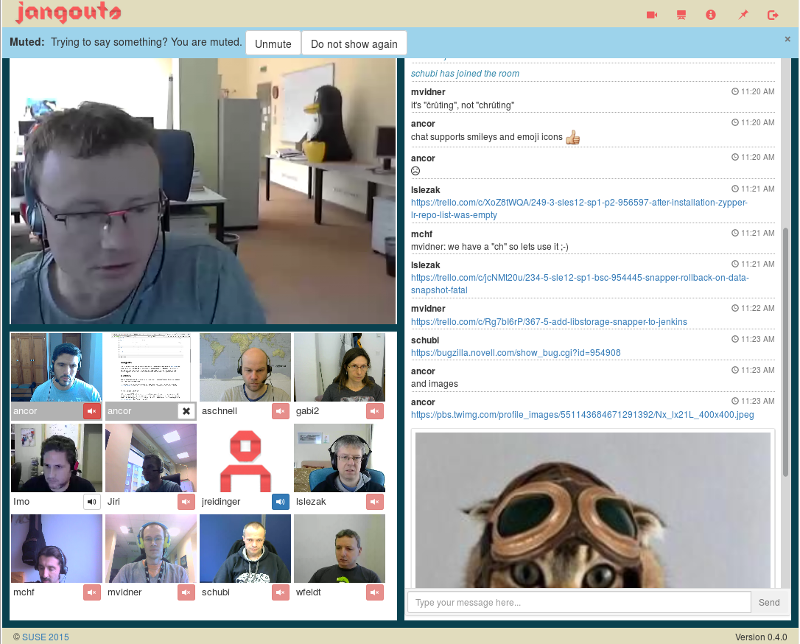

<!--
N.B.: README ini dibuat secara otomatis oleh <https://github.com/YunoHost/apps/tree/master/tools/readme_generator>
Ini TIDAK boleh diedit dengan tangan.
-->

# Jangouts untuk YunoHost

[](https://ci-apps.yunohost.org/ci/apps/jangouts/)


[](https://install-app.yunohost.org/?app=jangouts)

*[Baca README ini dengan bahasa yang lain.](./ALL_README.md)*

> *Paket ini memperbolehkan Anda untuk memasang Jangouts secara cepat dan mudah pada server YunoHost.*  
> *Bila Anda tidak mempunyai YunoHost, silakan berkonsultasi dengan [panduan](https://yunohost.org/install) untuk mempelajari bagaimana untuk memasangnya.*

## Ringkasan

Jangouts (for "Janus Hangouts") is a solution for videoconferencing based on WebRTC and the excellent Janus Gateway with a user interface loosely inspired by Google Hangouts. It aims to provide a completely self-hosted open source alternative to Google Hangouts and similar solutions. Currently Jangouts supports conferences with video, audio, screen sharing and textual chat organized into an unlimited amount of conference rooms with a configurable limit of participants per room.


**Versi terkirim:** 0.6.0~ynh1

## Tangkapan Layar



## Dokumentasi dan sumber daya

- Depot kode aplikasi hulu: <https://github.com/jangouts/jangouts>
- Gudang YunoHost: <https://apps.yunohost.org/app/jangouts>
- Laporkan bug: <https://github.com/YunoHost-Apps/jangouts_ynh/issues>

## Info developer

Silakan kirim pull request ke [`testing` branch](https://github.com/YunoHost-Apps/jangouts_ynh/tree/testing).

Untuk mencoba branch `testing`, silakan dilanjutkan seperti:

```bash
sudo yunohost app install https://github.com/YunoHost-Apps/jangouts_ynh/tree/testing --debug
atau
sudo yunohost app upgrade jangouts -u https://github.com/YunoHost-Apps/jangouts_ynh/tree/testing --debug
```

**Info lebih lanjut mengenai pemaketan aplikasi:** <https://yunohost.org/packaging_apps>
