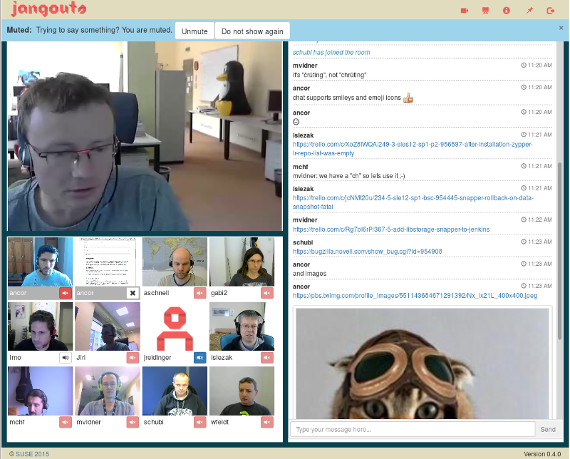

<!--
注意：此 README 由 <https://github.com/YunoHost/apps/tree/master/tools/readme_generator> 自动生成
请勿手动编辑。
-->

# YunoHost 上的 Jangouts

[](https://ci-apps.yunohost.org/ci/apps/jangouts/)


[](https://install-app.yunohost.org/?app=jangouts)

*[阅读此 README 的其它语言版本。](./ALL_README.md)*

> *通过此软件包，您可以在 YunoHost 服务器上快速、简单地安装 Jangouts。*  
> *如果您还没有 YunoHost，请参阅[指南](https://yunohost.org/install)了解如何安装它。*

## 概况

Jangouts (for "Janus Hangouts") is a solution for videoconferencing based on WebRTC and the excellent Janus Gateway with a user interface loosely inspired by Google Hangouts. It aims to provide a completely self-hosted open source alternative to Google Hangouts and similar solutions. Currently Jangouts supports conferences with video, audio, screen sharing and textual chat organized into an unlimited amount of conference rooms with a configurable limit of participants per room.


**分发版本：** 0.6.0~ynh1

## 截图



## 文档与资源

- 上游应用代码库： <https://github.com/jangouts/jangouts>
- YunoHost 商店： <https://apps.yunohost.org/app/jangouts>
- 报告 bug： <https://github.com/YunoHost-Apps/jangouts_ynh/issues>

## 开发者信息

请向 [`testing` 分支](https://github.com/YunoHost-Apps/jangouts_ynh/tree/testing) 发送拉取请求。

如要尝试 `testing` 分支，请这样操作：

```bash
sudo yunohost app install https://github.com/YunoHost-Apps/jangouts_ynh/tree/testing --debug
或
sudo yunohost app upgrade jangouts -u https://github.com/YunoHost-Apps/jangouts_ynh/tree/testing --debug
```

**有关应用打包的更多信息：** <https://yunohost.org/packaging_apps>
